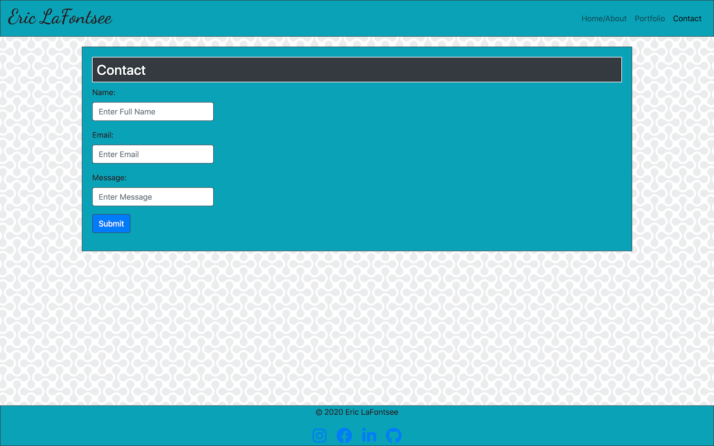

# Homework-Bootstrap
## Description
For our homework assignment, we needed to create a functional website utilizing Bootstrap components and it's grid.
The website I created was a portfolio with a Home/About page, a portfolio page, and a contact page.
Using the Bootstrap nav bar at the top, I created functional links to toggle between the three pages.
This website is also responsive so it can be viewed on any device without the user's experience suffering. As the screen gets smaller, the navbar will collapse into a hamburger menu and the images and text will begin to stack.
This is done through the use of the Bootsrap grid. My columns are designed for the smallest screen possible so that my webpage can work on any device.
Finally, this webpage is optimized for searching engines and other programmers. The html is semantically layed out with descriptive headers and 
alt attributes on photos.  

The html has been validated by the W3C.

## Usage




## Built With
Bootstrap  
HTML  
CSS  
JavaScript  
Font-Awesome

## Installation
To utilize Bootstrap components you must insert the following css into the head of your html: 
```html
<link rel="stylesheet" href="https://stackpath.bootstrapcdn.com/bootstrap/4.5.2/css/bootstrap.min.css">
```
To utliize the Bootstrap navgation menu you must insert the following javascript into the head of your html: 

```html
<script src="https://code.jquery.com/jquery-3.3.1.slim.min.js" integrity="sha384-q8i/X+965DzO0rT7abK41JStQIAqVgRVzpbzo5smXKp4YfRvH+8abtTE1Pi6jizo" crossorigin="anonymous"></script>
<script src="https://cdnjs.cloudflare.com/ajax/libs/popper.js/1.14.7/umd/popper.min.js" integrity="sha384-UO2eT0CpHqdSJQ6hJty5KVphtPhzWj9WO1clHTMGa3JDZwrnQq4sF86dIHNDz0W1" crossorigin="anonymous"></script>
<script src="https://stackpath.bootstrapcdn.com/bootstrap/4.3.1/js/bootstrap.min.js" integrity="sha384-JjSmVgyd0p3pXB1rRibZUAYoIIy6OrQ6VrjIEaFf/nJGzIxFDsf4x0xIM+B07jRM" crossorigin="anonymous"></script> 
```

To utilize the Font Awesome Icons you must insert the following script into the head of your html:

 ```html
<script src="https://kit.fontawesome.com/0ad6dfef5e.js" crossorigin="anonymous"></script> 
```

Finally, to utilize the Bootstrap grid in your webpage you must use the following format:

```html
<div class="container">
    <div class="row">
        <div class="col-12">
        </div>
    </div>
</div> 
  ```

## HTML Validation


 ## Author
 Eric LaFontsee

  ## License
  MIT
